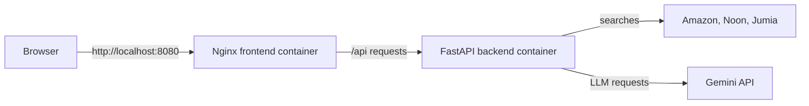

# Dockerization Walkthrough

This document explains how the backend and frontend are packaged and run with Docker Compose, and why each Docker-related file is present.

## What Dockerization Does Here

Docker packages each part of the application with the runtime it needs. Docker Compose starts the containers together on a private network:



The browser uses port `8080` to load the site and send API requests. Nginx and FastAPI communicate inside the Compose network using the service name `backend`. Port `8000` is also published so the API can be accessed directly from the host during development.

## Files Added or Changed

### `backend/Dockerfile`

Defines the FastAPI image:

1. Starts with Python 3.12 on a small Debian image.
2. Sets Python to avoid writing bytecode files and to flush logs promptly.
3. Copies `requirements.txt` and installs the Python packages before copying application source. This lets Docker reuse the dependency layer when only source code changes.
4. Installs Playwright's Chromium browser and the Linux packages Chromium needs. The scrapers need a real browser inside the backend container.
5. Copies the backend source into the image.
6. Declares port `8000` and checks the `/health` endpoint.
7. Starts Uvicorn on `0.0.0.0:8000`. Binding to `0.0.0.0` is necessary for traffic to reach the server from outside its container.

### `backend/.dockerignore`

Keeps Python caches, local virtual environments, and `.env` out of the backend build context. The API key is supplied to the running container by Compose, not copied into the image.

### `frontend/Dockerfile`

Uses two image stages:

1. The build stage uses Node.js 22, installs the frontend dependencies, and runs `npm run build` to produce static files in `dist/`.
2. The serving stage uses Nginx and copies in the built files and Nginx configuration. Node.js and the source tree are not needed to serve the finished site.

The build argument `VITE_API_BASE_URL=/api` is embedded into the frontend bundle by Vite. It makes the browser use the same host that served the page, instead of trying to resolve the backend's internal Docker hostname.

### `frontend/nginx.conf`

Configures Nginx to serve the static site and forward requests under `/api/` to `http://backend:8000`. Here, `backend` resolves to the backend service on the private Compose network. The final `try_files` rule serves `index.html` for frontend routes, which supports client-side routing.

### `frontend/.dockerignore`

Prevents local `node_modules`, previous build output, logs, and Git metadata from being sent as part of the frontend build context. Dependencies and build output are produced inside the Docker build instead.

### `docker-compose.yml`

Defines the two services and their relationship:

| Service | Build input | Host address | Purpose |
| --- | --- | --- | --- |
| `backend` | `./backend` | `localhost:8000` | FastAPI, CrewAI, and Playwright Chromium |
| `frontend` | `./frontend` | `localhost:8080` | Nginx serving the built React/Vite app |

The backend loads variables from `backend/.env` at runtime. Its health check calls `/health`; Compose starts the frontend after the backend reports healthy. No database volume is configured because this app currently has no database service or persistent container data.

### `frontend/src/api/searchApi.js`

Reads `VITE_API_BASE_URL` from the Vite build environment. The Docker build sets it to `/api`, which routes through Nginx. When running Vite directly on the host without that variable, the existing fallback calls `http://localhost:8000/api`.

## Run the Containers

From the repository root, create the backend environment file and add a valid Gemini API key to it. In PowerShell:

```powershell
Copy-Item backend/.env.example backend/.env
```

Then start and build the services:

```powershell
docker compose up --build
```

Open the frontend at `http://localhost:8080`. The FastAPI health endpoint is available at `http://localhost:8000/health`, and the API docs are at `http://localhost:8000/docs`.

Useful commands:

```powershell
# Follow service logs
docker compose logs -f

# Stop and remove the containers and Compose network
docker compose down
```

## Request Flow

When a user searches from the Dockerized frontend:

1. The browser sends `POST /api/search` to `localhost:8080`.
2. Nginx receives that request and proxies it to `backend:8000` over the Compose network.
3. FastAPI runs the search and its Playwright scrapers inside the backend container.
4. FastAPI returns JSON through Nginx to the browser.

The browser does not need to know the backend container's name or address. Docker's internal service DNS is only used by Nginx when forwarding the request.

## Configuration and Troubleshooting

- `backend/.env` must exist because Compose references it with `env_file`. Copy the example file before starting the stack, and keep the real API key out of source control.
- If ports `8000` or `8080` are already in use, change the host-side value before the colon in `docker-compose.yml`; keep the container-side value after the colon unchanged.
- If frontend build-time settings change, rebuild the image with `docker compose up --build`; Vite embeds `VITE_*` variables into the static bundle during the build.
- Inspect failures with `docker compose logs backend` or `docker compose logs frontend`.

## Validation Note

The Compose configuration was checked with `docker compose config` earlier. The Docker image build was skipped, so a successful `docker compose build` and container startup have not yet been confirmed.